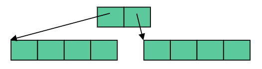
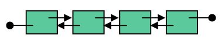
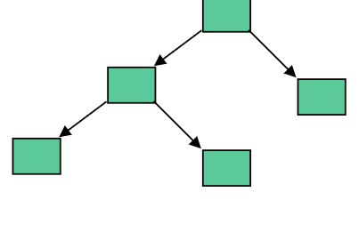
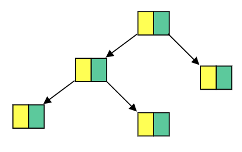

exclude: true

```{r setup, message=FALSE, warning=FALSE, include=FALSE}
library(tidyverse)
library(Rcpp)

options(tibble.width = 110, width = 110)
```

```{r global_options}
knitr::opts_chunk$set(cache=TRUE)
```

---
class: middle

## Common Methods

---

## Iterators

|                 | Method              |  Description                                                      |
|-----------------|---------------------|-------------------------------------------------------------------|
| **Accessors**   | `v.begin()`         |  Get iterator for 1st element                                     | 
|                 | `v.end()`           |  Get iterator for *past-the-end* element                          |
|                 | `v.rbegin()`        |  Get reverse iterator for last element                            | 
|                 | `v.rend()`          |  Get reverse iterator for the element preceding the first element |
|                 | `v.cbegin()`        |  Get const iterator for 1st element                               | 
|                 | `v.cend()`          |  Get const iterator for *past-the-end* element                    |
|                 | `v.crbegin()`       |  Get const reverse iterator for last element                      | 
|                 | `v.crend()`         |  Get const reverse iterator for the element preceding the first element |

---

.smaller[
```{Rcpp}
#include <Rcpp.h>
// [[Rcpp::plugins(cpp11)]]
// [[Rcpp::export]]
void iters() {
  std::vector<int> a = {1, 2, 3, 4, 5};
  
  Rcpp::Rcout << "a.begin() -> a.end():\n"; 
  for(auto x = a.begin(); x != a.end(); ++x) {
    Rcpp::Rcout << *x << ", ";
  }
  Rcpp::Rcout << "\b\b  \n\n";

  Rcpp::Rcout << "a.rbegin() -> a.rend():\n"; 
  for(auto x = a.rbegin(); x != a.rend(); ++x) {
    Rcpp::Rcout << *x << ", ";
  }
  Rcpp::Rcout << "\b\b  \n\n";
}
```

```{r}
iters()
```
]

---

.smaller[
```{Rcpp}
#include <Rcpp.h>
// [[Rcpp::plugins(cpp11)]]
// [[Rcpp::export]]
void citers() {
  std::vector<int> a = {1, 2, 3, 4, 5};
  
  Rcpp::Rcout << "a.begin() -> a.end():\n"; 
  for(auto x = a.begin(); x != a.end(); ++x) {
    Rcpp::Rcout << *x << ", ";
  }
  Rcpp::Rcout << "\b\b  \n\n";

  *a.begin() = 7;
  //*a.cbegin() = 7;
  
  Rcpp::Rcout << "a.begin() -> a.end():\n"; 
  for(auto x = a.begin(); x != a.end(); ++x) {
    Rcpp::Rcout << *x << ", ";
  }
  Rcpp::Rcout << "\b\b  \n\n";
}
```

```{r}
citers()
```
]

---

## Other methods

|                 | Method              |  Description                                                      |
|-----------------|---------------------|-------------------------------------------------------------------|
| **Capacity**    | `v.size()`          |  Get number of elements                                           | 
|                 | `v.max_size()`      |  Get maximum number of elements a container can hold              |
|                 | `v.empty()`         |  Predicate function checking if container is empty                | 
| **Modifiers**   | `v.clear()`         |  Removes all elements from container                              |
|                 | `v.swap(x)`         |  Exchanges the content of `v` with `x`                            |

---

.smaller[
```{Rcpp}
#include <Rcpp.h>
#include <array>
// [[Rcpp::plugins(cpp11)]]
// [[Rcpp::export]]
void size() {
  std::array<int, 3> a;
  std::vector<int> b;
  std::vector<std::string> c;
  std::list<int> d;
  std::list<std::string> e;
  std::set<int> f;
  std::set<std::string> g;
  
  Rcpp::Rcout << "std::array<int, 3> a       size=" << a.size() << "   max_size=" << a.max_size() << "\n";
  Rcpp::Rcout << "std::vector<int> b         size=" << b.size() << "   max_size=" << b.max_size() << "\n";
  Rcpp::Rcout << "std::vector<std::string> c size=" << c.size() << "   max_size=" << c.max_size() << "\n";
  Rcpp::Rcout << "std::list<int> d           size=" << d.size() << "   max_size=" << d.max_size() << "\n";
  Rcpp::Rcout << "std::list<std::string> e   size=" << e.size() << "   max_size=" << e.max_size() << "\n";
  Rcpp::Rcout << "std::set<int> f            size=" << f.size() << "   max_size=" << f.max_size() << "\n";
  Rcpp::Rcout << "std::set<std::string> g    size=" << g.size() << "   max_size=" << g.max_size() << "\n";
}
```

```{r}
size()
```
]

---
class: middle

# Sequence Containers

---

## `std::array` - *C++11*

.center[

]

|                 | Method              | Complexity                   | Description                      |
|-----------------|---------------------|------------------------------|----------------------------------|
| **Accessors**   | `v[i]`              | $\mathcal{O}(1)$             | Get element at position i        | 
|                 | `v.at[i]`           | $\mathcal{O}(1)$             | Get element at position i        | 
|                 | `v.front()`         | $\mathcal{O}(1)$             | Get first element                | 
|                 | `v.back()`          | $\mathcal{O}(1)$             | Get last element                 | 

---

.smaller[
```{Rcpp}
#include <Rcpp.h>
#include <array>
// [[Rcpp::plugins(cpp11)]]

// [[Rcpp::export]]
void std_array() {
  std::array<int, 3> a = {1, 2, 3};
  std::array<std::string, 2> s = {std::string("Hello"), "world!"};
  
  Rcpp::Rcout << "a: "; 
  for(auto const& v: a) {
    Rcpp::Rcout << v << ", ";
  }
  Rcpp::Rcout << "\b\b  \n";
  
  Rcpp::Rcout << "s: "; 
  for(auto const& v: s) {
    Rcpp::Rcout << v << ", ";
  }
  Rcpp::Rcout << "\b\b  \n";
}
```

```{r}
std_array()
```
]

---

## `std::vector`

.center[

]

|                 | Method              | Complexity                   | Description                      |
|-----------------|---------------------|------------------------------|----------------------------------|
| **Accessors**   | `v[i]`              | $\mathcal{O}(1)$             | Get element at position i        | 
|                 | `v.at[i]`           | $\mathcal{O}(1)$             | Get element at position i        | 
|                 | `v.front()`         | $\mathcal{O}(1)$             | Get first element                | 
|                 | `v.back()`          | $\mathcal{O}(1)$             | Get last element                 | 
| **Modifiers**   | `v.push_back(x)`    | $\mathcal{O}(1)$ (amortized) | Add x to the back                | 
|                 | `v.pop_back(x)`     | $\mathcal{O}(1)$             | Remove and return back element   | 
|                 | `v.insert(it, x)`   | $\mathcal{O}(n)$             | Insert x after it                | 
|                 | `v.erase(it)`       | $\mathcal{O}(n)$             | Erase element at it              | 

---

.smaller[
```{Rcpp}
#include <Rcpp.h>
// [[Rcpp::plugins(cpp11)]]

// [[Rcpp::export]]
void std_vector() {
  std::vector<int> a = {0, 1, 2, 3, 4};
  
  Rcpp::Rcout << "a: "; 
  for(auto it = a.begin(); it != a.end(); ++it) {
    Rcpp::Rcout << *it << ", ";
  }
  Rcpp::Rcout << "\b\b  \n";
  
  Rcpp::Rcout << "a[3] = " << a[3] << "   // subset\n";
  
  auto it = a.begin();
  Rcpp::Rcout << "a[3] = " << *(++(++(++it))) << "   // pre-increment\n";
  
  it = a.end();
  Rcpp::Rcout << "a[3] = " << *(--(--it)) << "   // pre-decrement\n";
  
  it = a.begin();
  Rcpp::Rcout << "a[3] = " << *(it + 3) << "   // iterator add\n";
  
  it = a.begin();
  std::advance(it, 3);
  Rcpp::Rcout << "a[3] = " << *it << "   // std::advance from begin\n";
  
  it = a.end();
  std::advance(it, -2);
  Rcpp::Rcout << "a[3] = " << *it << "   // std::advance from end\n";
}
```

```{r}
std_vector()
```
]

---

## `std::deque`

.center[

]

|                 | Method              | Complexity                   | Description                      |
|-----------------|---------------------|------------------------------|----------------------------------|
| **Accessors**   | `v[i]`              | $\mathcal{O}(1)$             | Get element at position i        | 
|                 | `v.at[i]`           | $\mathcal{O}(1)$             | Get element at position i        | 
|                 | `v.front()`         | $\mathcal{O}(1)$             | Get first element                | 
|                 | `v.back()`          | $\mathcal{O}(1)$             | Get last element                 | 
| **Modifiers**   | `v.push_back(x)`    | $\mathcal{O}(1)$ (amortized) | Add x to the back                | 
|                 | `v.pop_back(x)`     | $\mathcal{O}(1)$             | Remove and return back element   | 
|                 | `v.push_front(x)`   | $\mathcal{O}(1)$ (amortized) | Add x to the front               | 
|                 | `v.pop_front(x)`    | $\mathcal{O}(1)$             | Remove and return front element  | 
|                 | `v.insert(it, x)`   | $\mathcal{O}(n)$             | Insert x after it                | 
|                 | `v.erase(it)`       | $\mathcal{O}(n)$             | Erase element at it              | 

---

.smaller[
```{Rcpp}
#include <Rcpp.h>
#include <deque>
// [[Rcpp::plugins(cpp11)]]
// [[Rcpp::export]]
void std_deque() {
  std::deque<int> a = {0, 1, 2, 3, 4};
  
  Rcpp::Rcout << "a: "; 
  for(auto it = a.begin(); it != a.end(); ++it) {
    Rcpp::Rcout << *it << ", ";
  }
  Rcpp::Rcout << "\b\b  \n";
  
  Rcpp::Rcout << "a[3] = " << a[3] << "   // subset\n";
  
  auto it = a.begin();
  Rcpp::Rcout << "a[3] = " << *(++(++(++it))) << "   // pre-increment\n";
  
  it = a.end();
  Rcpp::Rcout << "a[3] = " << *(--(--it)) << "   // pre-decrement\n";
  
  it = a.begin();
  Rcpp::Rcout << "a[3] = " << *(it + 3) << "   // iterator add\n";
  
  it = a.begin();
  std::advance(it, 3);
  Rcpp::Rcout << "a[3] = " << *it << "   // std::advance from begin\n";
  
  it = a.end();
  std::advance(it, -2);
  Rcpp::Rcout << "a[3] = " << *it << "   // std::advance from end\n";
}
```

```{r}
std_deque()
```
]

---

## `std::list`

.center[

]

|                 | Method              | Complexity              | Description                      |
|-----------------|---------------------|-------------------------|----------------------------------|
| **Accessors**   | `v.front()`         | $\mathcal{O}(1)$        | Get first element                |
|                 | `v.back()`          | $\mathcal{O}(1)$        | Get last element                 |
| **Modifiers**   | `v.push_back(x)`    | $\mathcal{O}(1)$        | Add x to the back                |
|                 | `v.pop_back()`      | $\mathcal{O}(1)$        | Remove and return back element   |
|                 | `v.push_front(x)`   | $\mathcal{O}(1)$        | Add x to the front               |
|                 | `v.pop_front()`     | $\mathcal{O}(1)$        | Remove and return front element  |
|                 | `v.insert(it, x)`   | $\mathcal{O}(1)$        | Insert x after it                |
|                 | `v.erase(it)`       | $\mathcal{O}(1)$        | Erase element at it              |
|                 | `v.remove(x)`       | $\mathcal{O}(n)$        | Remove all occurances of x       |
|                 | `v.reverse()`       | $\mathcal{O}(n)$        | Reverse elements                 |
|                 | `v.sort()`          | $\mathcal{O}(n \log n)$ | Sort elements                    |

---

.smaller[
```{Rcpp}
#include <Rcpp.h>
// [[Rcpp::plugins(cpp11)]]

// [[Rcpp::export]]
void std_list() {
  std::list<int> a = {0, 1, 2, 3, 4};
  
  Rcpp::Rcout << "a: "; 
  for(auto it = a.begin(); it != a.end(); ++it) {
    Rcpp::Rcout << *it << ", ";
  }
  Rcpp::Rcout << "\b\b  \n";
  
  //Rcpp::Rcout << "a[3] = " << a[3] << "   // subset\n";
  
  auto it = a.begin();
  Rcpp::Rcout << "a[3] = " << *(++(++(++it))) << "   // pre-increment\n";
  
  it = a.end();
  Rcpp::Rcout << "a[3] = " << *(--(--it)) << "   // pre-decrement\n";
  
  //it = a.begin();
  //Rcpp::Rcout << "a[3] = " << *(it + 3) << "   // iterator add\n";
  
  it = a.begin();
  std::advance(it, 3);
  Rcpp::Rcout << "a[3] = " << *it << "   // std::advance from begin\n";
  
  it = a.end();
  std::advance(it, -2);
  Rcpp::Rcout << "a[3] = " << *it << "   // std::advance from end\n";
}
```

```{r}
std_list()
```
]

---

## `std::forward_list` - *C++11*

.center[

]

|                 | Method                  | Complexity              | Description                      |
|-----------------|-------------------------|-------------------------|----------------------------------|
| **Accessors**   | `v.front()`             | $\mathcal{O}(1)$        | Get first element                |
| **Modifiers**   | `v.push_front(x)`       | $\mathcal{O}(1)$        | Add x to the front               |
|                 | `v.pop_front()`         | $\mathcal{O}(1)$        | Remove and return front element  |
|                 | `v.insert_after(it, x)` | $\mathcal{O}(1)$        | Insert x after it                |
|                 | `v.erase_after(it)`     | $\mathcal{O}(1)$        | Erase element at it              |
|                 | `v.remove(x)`           | $\mathcal{O}(n)$        | Remove all occurances of x       |
|                 | `v.reverse()`           | $\mathcal{O}(n)$        | Reverse elements                 |
|                 | `v.sort()`              | $\mathcal{O}(n \log n)$ | Sort elements                    |

---

.smaller[
```{Rcpp}
#include <Rcpp.h>
#include <forward_list>
// [[Rcpp::plugins(cpp11)]]

// [[Rcpp::export]]
void std_forward_list() {
  std::forward_list<int> a = {0, 1, 2, 3, 4};
  
  Rcpp::Rcout << "a: "; 
  for(auto it = a.begin(); it != a.end(); ++it) {
    Rcpp::Rcout << *it << ", ";
  }
  Rcpp::Rcout << "\b\b  \n";
  
  //Rcpp::Rcout << "a[3] = " << a[3] << "   // subset\n";
  
  auto it = a.begin();
  Rcpp::Rcout << "a[3] = " << *(++(++(++it))) << "   // pre-increment\n";
  
  //it = a.end();
  //Rcpp::Rcout << "a[3] = " << *(--(--it)) << "   // pre-decrement\n";
  
  //it = a.begin();
  //Rcpp::Rcout << "a[3] = " << *(it + 3) << "   // iterator add\n";
  
  it = a.begin();
  std::advance(it, 3);
  Rcpp::Rcout << "a[3] = " << *it << "   // std::advance from begin\n";
  
  //it = a.end();
  //std::advance(it, -2);
  //Rcpp::Rcout << "a[3] = " << *it << "   // std::advance from end\n";
}
```

```{r}
std_forward_list()
```
]


---
class: middle

# Associative Containers

---

## `std::set` & `std::multiset`

.center[

]

|                 | Method              | Complexity              | Description                      |
|-----------------|---------------------|-------------------------|----------------------------------|
| **Accessors**   | `v.find(x)`         | $\mathcal{O}(\log n)$   | Find element                     |
|                 | `v.count(x)`        | $\mathcal{O}(\log n)$   | Number of items equal to x       |
| **Modifiers**   | `v.insert(x)`       | $\mathcal{O}(\log n)$   | Insert element with value x      |

---

.smaller[
```{Rcpp}
#include <Rcpp.h>
#include <set>
// [[Rcpp::plugins(cpp11)]]

// [[Rcpp::export]]
void std_set() {
  std::set<int> a = {0, 3, 5};
  
  Rcpp::Rcout << "a: "; 
  for(auto it = a.begin(); it != a.end(); ++it) {
    Rcpp::Rcout << *it << ", ";
  }
  Rcpp::Rcout << "\b\b  \n";
  
  Rcpp::Rcout << "a.count(1) = " << a.count(1) << "\n";
  Rcpp::Rcout << "a.count(2) = " << a.count(2) << "\n";
  Rcpp::Rcout << "a.count(3) = " << a.count(3) << "\n";
  
  Rcpp::Rcout << "\nInserting 2 ...\n";
  a.insert(2);
  Rcpp::Rcout << "Inserting 3 ...\n\n";
  a.insert(3);
  
  Rcpp::Rcout << "a.count(1) = " << a.count(1) << "\n";
  Rcpp::Rcout << "a.count(2) = " << a.count(2) << "\n";
  Rcpp::Rcout << "a.count(3) = " << a.count(3) << "\n";
}
```

```{r}
std_set()
```
]

---

.smaller[
```{Rcpp}
#include <Rcpp.h>
#include <set>
// [[Rcpp::plugins(cpp11)]]

// [[Rcpp::export]]
void std_multiset() {
  std::multiset<int> a = {0, 3, 5};
  
  Rcpp::Rcout << "a: "; 
  for(auto it = a.begin(); it != a.end(); ++it) {
    Rcpp::Rcout << *it << ", ";
  }
  Rcpp::Rcout << "\b\b  \n";
  
  Rcpp::Rcout << "a.count(1) = " << a.count(1) << "\n";
  Rcpp::Rcout << "a.count(2) = " << a.count(2) << "\n";
  Rcpp::Rcout << "a.count(3) = " << a.count(3) << "\n";
  
  Rcpp::Rcout << "\nInserting 2 ...\n";
  a.insert(2);
  Rcpp::Rcout << "Inserting 3 ...\n\n";
  a.insert(3);
  
  Rcpp::Rcout << "a.count(1) = " << a.count(1) << "\n";
  Rcpp::Rcout << "a.count(2) = " << a.count(2) << "\n";
  Rcpp::Rcout << "a.count(3) = " << a.count(3) << "\n";
}
```

```{r}
std_multiset()
```
]

---

## `std::map` & `std::multimap`

.center[

]

|                 | Method              | Complexity              | Description                      |
|-----------------|---------------------|-------------------------|----------------------------------|
| **Accessors**   | `v[x]`              | $\mathcal{O}(\log n)$   | Retrieve value stored for x      |
|                 | `v.find(x)`         | $\mathcal{O}(\log n)$   | Find key x                       |
| **Modifiers**   | `v[x] = val`        | $\mathcal{O}(\log n)$   | Store value  in key x            |
|                 | `v.insert(x)`       | $\mathcal{O}(\log n)$   | Insert x                         |

---

.smaller[
```{Rcpp}
#include <Rcpp.h>
// [[Rcpp::plugins(cpp11)]]

// [[Rcpp::export]]
void std_map() {
  std::map<std::string, int> a = {
    {"hij", 3},
    {"def", 1}
  };
  
  a["abc"] = 5;
  
  Rcpp::Rcout << "a:\n"; 
  for(auto it = a.begin(); it != a.end(); ++it) {
    Rcpp::Rcout << "  "  << it->first 
                << " : " << it->second << "\n";
  }
  
  a["abc"] = 77;
  a.insert(std::make_pair("klm", 32));
  
  Rcpp::Rcout << "a:\n"; 
  for(auto it = a.begin(); it != a.end(); ++it) {
    Rcpp::Rcout << "  "  << it->first 
                << " : " << it->second << "\n";
  }
}
```

```{r}
std_map()
```
]

---

.smaller[
```{Rcpp}
#include <Rcpp.h>
// [[Rcpp::plugins(cpp11)]]

// [[Rcpp::export]]
void std_multimap() {
  std::multimap<std::string, int> a = {
    {"hij", 3},
    {"def", 1},
    {"abc", 5}
  };
  
  Rcpp::Rcout << "a:\n"; 
  for(auto it = a.begin(); it != a.end(); ++it) {
    Rcpp::Rcout << "  "  << it->first 
                << " : " << it->second << "\n";
  }
  
  //a["abc"] = 77;
  a.insert(std::make_pair("abc", 77));
  a.insert(std::make_pair("klm", 32));
  
  Rcpp::Rcout << "a:\n"; 
  for(auto it = a.begin(); it != a.end(); ++it) {
    Rcpp::Rcout << "  "  << it->first 
                << " : " << it->second << "\n";
  }
}
```

```{r}
std_multimap()
```
]

---

.smaller[
```{Rcpp}
#include <Rcpp.h>
// [[Rcpp::plugins(cpp11)]]

// [[Rcpp::export]]
void std_multimap_find() {
  std::multimap<std::string, int> a = {
    {"hij", 3},
    {"def", 1},
    {"abc", 5},
    {"abc", 77},
  };
  
  Rcpp::Rcout << "Find \"abc\":\n"; 
  for(auto it = a.find("abc"); it != a.end(); ++it) {
    Rcpp::Rcout << "  "  << it->first 
                << " : " << it->second << "\n";
  }
  
  Rcpp::Rcout << "Find \"def\":\n"; 
  for(auto it = a.find("def"); it != a.end(); ++it) {
    Rcpp::Rcout << "  "  << it->first 
                << " : " << it->second << "\n";
  }

  Rcpp::Rcout << "Find \"xyz\":\n"; 
  for(auto it = a.find("xyz"); it != a.end(); ++it) {
    Rcpp::Rcout << "  "  << it->first 
                << " : " << it->second << "\n";
  }
}
```

```{r}
std_multimap_find()
```
]

---

.smaller[
```{Rcpp}
#include <Rcpp.h>
// [[Rcpp::plugins(cpp11)]]

// [[Rcpp::export]]
void std_multimap_find2() {
  std::multimap<std::string, int> a = {
    {"hij", 3},
    {"def", 1},
    {"abc", 5},
    {"abc", 77},
  };
  
  Rcpp::Rcout << "Find \"abc\":\n"; 
  for(auto it = a.find("abc"); it != a.end() && it->first == "abc"; ++it) {
    Rcpp::Rcout << "  "  << it->first 
                << " : " << it->second << "\n";
  }
  
  Rcpp::Rcout << "Find \"def\":\n"; 
  for(auto it = a.find("def"); it != a.end() && it->first == "def"; ++it) {
    Rcpp::Rcout << "  "  << it->first 
                << " : " << it->second << "\n";
  }
  
  Rcpp::Rcout << "Find \"xyz\":\n"; 
  for(auto it = a.find("xyz"); it != a.end() && it->first == "x7z"; ++it) {
    Rcpp::Rcout << "  "  << it->first 
                << " : " << it->second << "\n";
  }
}
```

```{r}
std_multimap_find2()
```
]
