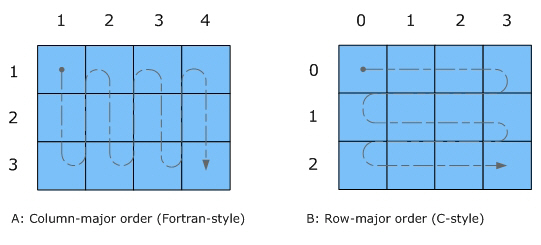

exclude: true

```{r setup, message=FALSE, warning=FALSE, include=FALSE}
library(tidyverse)
library(Rcpp)

options(tibble.width = 110, width = 110)
```

```{r global_options}
knitr::opts_chunk$set(cache=TRUE)
```

---

## Armadillo

<br/>

```{r echo=FALSE, fig.align="center", out.width="66%"}

```

<br/>

* Developed by Dr. Conrad Sanderson and Dr Ryan Curtin 

* Template based linear algebra library with high level syntax (like R or Matlab)

* Heavy lifting is (mostly) handled by LAPACK (i.e. benefits from OpenBLAS)

* Supports vectors, matrices, and cubes in dense or sparse format

* Some builtin expression optimization via template meta-programming

* Header only or shared library versions available

---

## Basic types

Armadillo has 4 basic (dense) templated types:

.center-column[
```c++
arma::Col<type>,
arma::Row<type>, 
arma::Mat<type>, 
arma::Cube<type>
```
]

These types can be specialized using one of the following data types:

.center-column[
```c++
float, double,
std::complex<float>, std::complex<double>, 
short, int, long, 
unsigned short, unsigned int, unsigned long
```
]

---

## typedef Shortcuts

For convenience the following typedefs have been defined:

* Vectors:

.center-column[
```c++
arma::vec     = arma::colvec     =  arma::Col<double>
arma::dvec    = arma::dcolvec    =  arma::Col<double>
arma::fvec    = arma::fcolvec    =  arma::Col<float>
arma::cx_vec  = arma::cx_colvec  =  arma::Col<cx_double>
arma::cx_dvec = arma::cx_dcolvec =  arma::Col<cx_double>
arma::cx_fvec = arma::cx_fcolvec =  arma::Col<cx_float>
arma::uvec    = arma::ucolvec    =  arma::Col<uword>
arma::ivec    = arma::icolvec    =  arma::Col<sword>
```
]

* Matrices

.center-column[
```c++
arma::mat     = arma::Mat<double>
arma::dmat    = arma::Mat<double>
arma::fmat    = arma::Mat<float>
arma::cx_mat  = arma::Mat<cx_double>
arma::cx_dmat = arma::Mat<cx_double>
arma::cx_fmat = arma::Mat<cx_float>
arma::umat    = arma::Mat<uword>
arma::imat    = arma::Mat<sword>
```
]

---

## RcppArmadillo

* Written and maintained by Dirk Eddelbuettel, Romain Francois, Doug Bates and Binxiang Ni

* Provides the header only version of Armadillo along with additional wrappers
  * Wrappers provide easy conversion between Rcpp types and Armadillo types
  * Enables use of Rcpp attributes and related tools
  
<br/>  
  
* Requirements - include the following in your C++ code

.center-column[
```c++
// [[Rcpp::depends(RcppArmadillo)]]

#include <RcppArmadillo.h>
```
]

---

## Example Program

```{Rcpp}
// [[Rcpp::depends(RcppArmadillo)]]

#include <RcppArmadillo.h>

// [[Rcpp::export]]
void test_randu() {
  arma::mat A = arma::randu<arma::mat>(4,5);
  Rcpp::Rcout << A << "\n";
}
```

```{r}
test_randu()
```

---

## Class attributes

| Attribute      | Description                                                               |
|----------------|---------------------------------------------------------------------------|
| `.n_rows`      | number of rows; present in Mat, Col, Row, Cube, field and SpMat           |
| `.n_cols`      | number of columns; present in Mat, Col, Row, Cube, field and SpMat        |
| `.n_elem`      | total number of elements; present in Mat, Col, Row, Cube, field and SpMat |
| `.n_slices`    | number of slices; present in Cube and field                               |

---

```{Rcpp}
// [[Rcpp::depends(RcppArmadillo)]]

#include <RcppArmadillo.h>

// [[Rcpp::export]]
void test_attr(arma::mat m) {
  Rcpp::Rcout << "m.n_rows = " << m.n_rows << "\n";
  Rcpp::Rcout << "m.n_cols = " << m.n_cols << "\n";
  Rcpp::Rcout << "m.n_elem = " << m.n_elem << "\n";
}
```

.columns[
.col[
```{r, error=TRUE}
test_attr(matrix(0, 3, 3))
test_attr(matrix(1, 4, 5))
```
]

.col[
```{r, error=TRUE}
test_attr(1:10)
test_attr(as.matrix(1:10))
```
]
]

---

## Element access

For an  `arma::vec v`,

| Call        |  Description                                        |
|-------------|-----------------------------------------------------|
| `v(i)`      | Access the `i`-th element with bounds checking        |
| `v.at(i)`   | Access the `i`-th element without bounds checking     |
| `v[i]`      | Access the `i`-th element without bounds checking     |

For an `arma::mat m`,

| Call        | type    |  Description                                        |
|-------------|---------|-----------------------------------------------------|
| `m(i)`      | `mat`   | Access the `i`-th element, treating object as flat and in column major order |
| `m(i,j)`    | `mat`   | Access the element in `i`-th row and `j`-th column with bounds checking      |
| `m.at(i,j)` | `mat`   | Access the element in `i`-th row and `j`-th column without bounds checking   |

---

## Element access - Cubes

For an `arma::cube c`,

| Call        | type    |  Description                                        |
|-------------|---------|-----------------------------------------------------|
| `c(i)`      | `cube`  | Access the i-th element, treating object as flat and in column major order |
| `c(i,j,k)`   | `cube` | Access the element in `i`-th row, `j`-th column, and `k`-th slice with bounds checking      |
| `c.at(i,j,k)`| `cube` | Access the element in `i`-th row, `j`-th column, and `k`-th slice without bounds checking   |


---

## Data Organization

```{r echo=FALSE, fig.align="center", out.width="66%"}

```


.footnote[[Image source](https://scc.ustc.edu.cn/zlsc/tc4600/intel/2017.0.098/mkl/common/mkl_userguide/GUID-ABCC618B-43C4-4DCD-ADA2-6F061B5116CD.html)
]

---

```{Rcpp}
// [[Rcpp::depends(RcppArmadillo)]]
#include <RcppArmadillo.h>

// [[Rcpp::export]]
void test_order(arma::mat m) {
  for(int i=0; i!=m.n_elem; ++i) {
    Rcpp::Rcout << m(i) << " ";
  }
  Rcpp::Rcout << "\n";
}
```

```{r}
m = matrix(1:9, 3, 3)
c(m)
test_order(m)

c(t(m))
test_order(t(m))
```


---

## `fastLm` example

```{Rcpp}
// [[Rcpp::depends(RcppArmadillo)]]
#include <RcppArmadillo.h>

// [[Rcpp::export]]
Rcpp::List fastLm(const arma::mat& X, const arma::colvec& y) {
    int n = X.n_rows, k = X.n_cols;
        
    arma::colvec coef = arma::solve(X, y);    // fit model y ~ X
    arma::colvec res  = y - X*coef;           // residuals

    // std.errors of coefficients
    double s2 = std::inner_product(res.begin(), res.end(), res.begin(), 0.0)/(n - k);
                                                        
    arma::colvec std_err = arma::sqrt(s2 * arma::diagvec(arma::pinv(arma::trans(X)*X)));

    return Rcpp::List::create(
      Rcpp::Named("coefficients") = coef,
      Rcpp::Named("stderr")       = std_err,
      Rcpp::Named("df.residual")  = n - k
    );
}
```

---
.smaller[
```{r}
library(dplyr)
n=1e5
d = tibble(
  x1 = rnorm(n),
  x2 = rnorm(n),
  x3 = rnorm(n),
  x4 = rnorm(n),
  x5 = rnorm(n),
) %>%
  mutate(
    y = 3 + x1 - x2 + 2*x3 -2*x4 + 3*x5 - rnorm(n)
  )

res = bench::press(
  size = c(100, 1000, 10000, 100000),
  {
    d = d[seq_len(size),]
    X = model.matrix(y ~ ., d)
    y = as.matrix(d$y)
    
    bench::mark(
      lm(y~., data=d),
      lm.fit(X,y),
      .lm.fit(X,y),
      fastLm(X,y),
      check = FALSE
    )
  }
)
```
]

---

```{r echo=FALSE, fig.align="center"}
plot(res)
```

---
class: middle

# MVN Example
